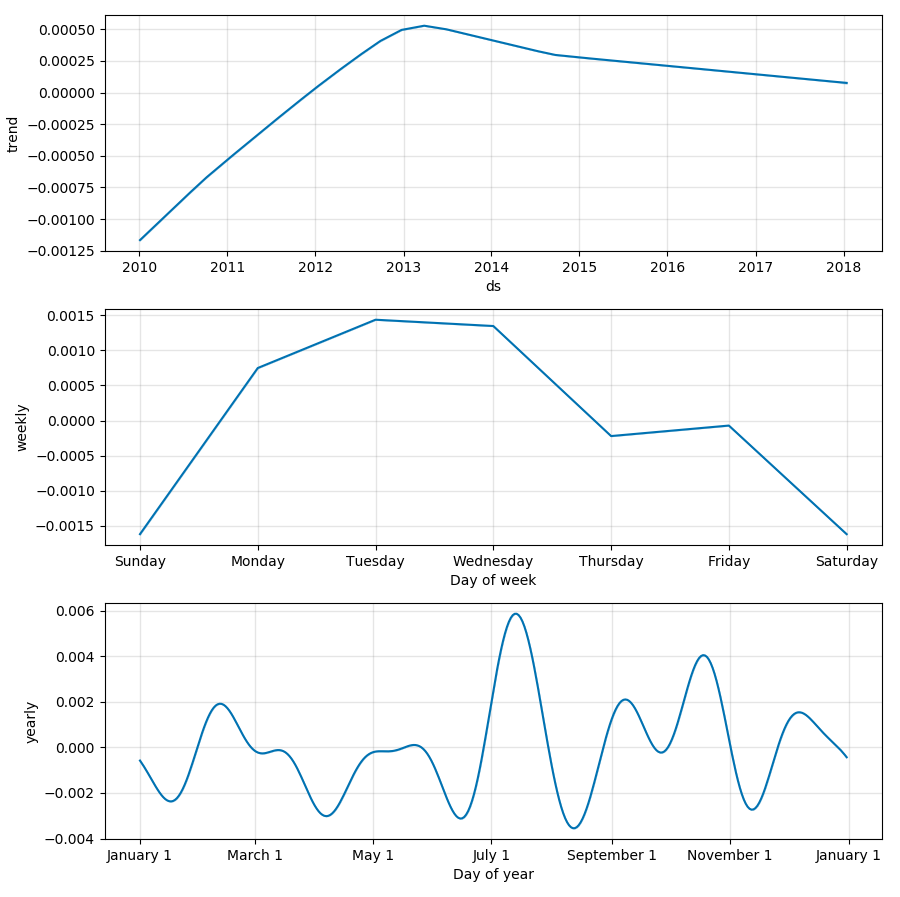
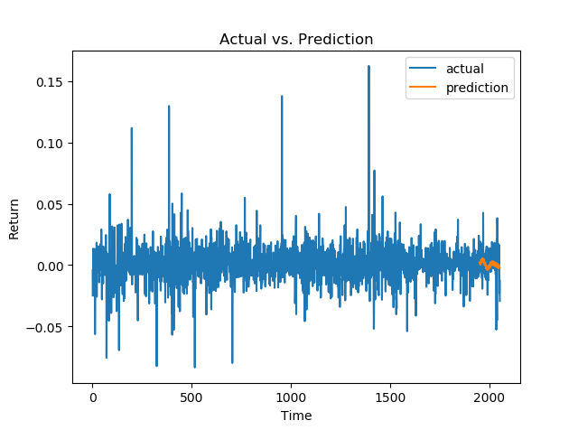
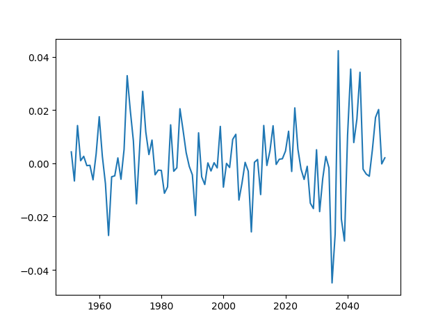
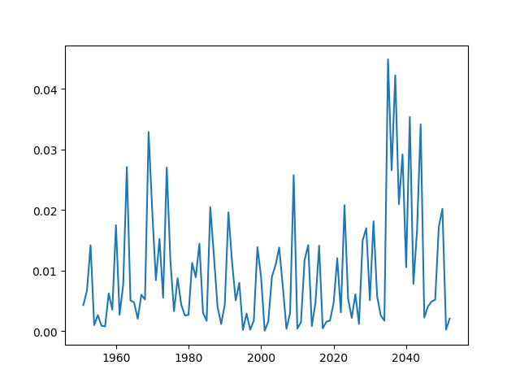

# Naive implementation of backtesting

## Scope

- implement simple backtesting for stock returns
- use results to see performance of facebook's prophet library

## Backtesting approach
- take a stocks historical price values
- calculate returns (good practice)
- cut dataset into two parts, one representing whole dataset, the second will only contain values from the past to a certain point
- apply prophet library onto the second incomplete dataset
- plot both results onto a graph
- calculate difference between real values and predicted values
- possibly: play with prophet library to improve predictions 

## Current outputs produced
### Example: Apple stock from 2010-01-01 to 2018-03-01

